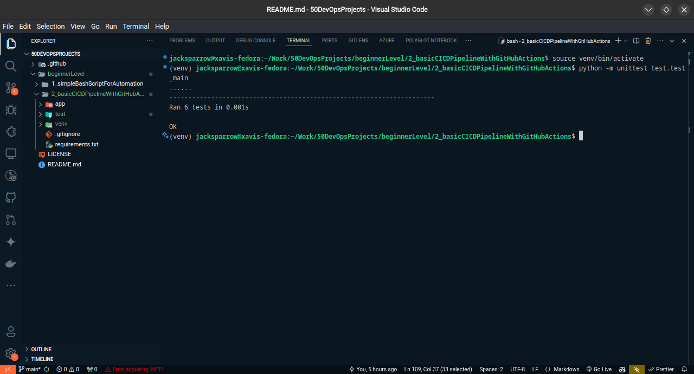
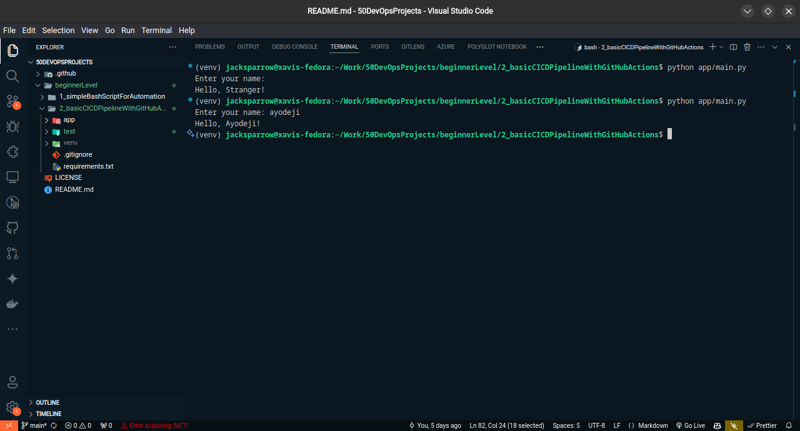
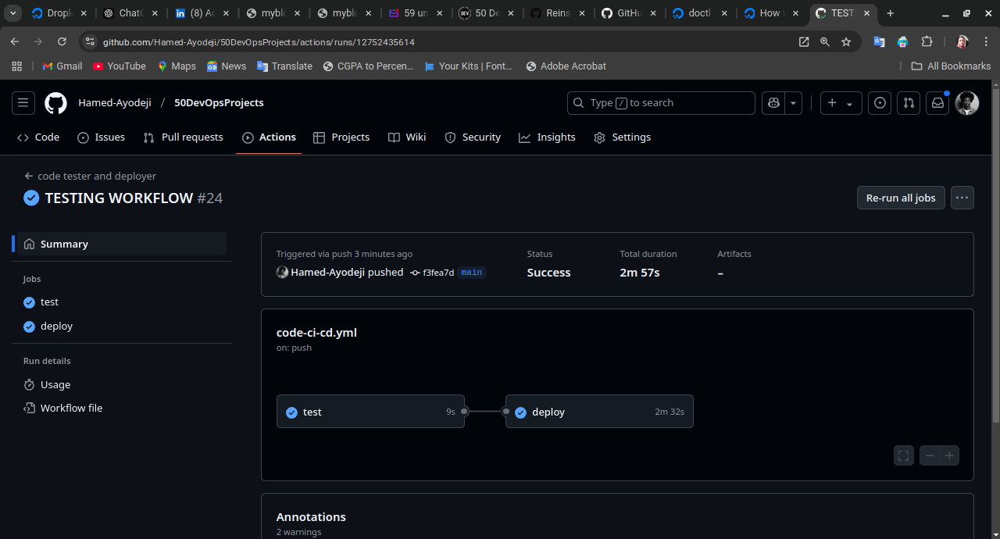
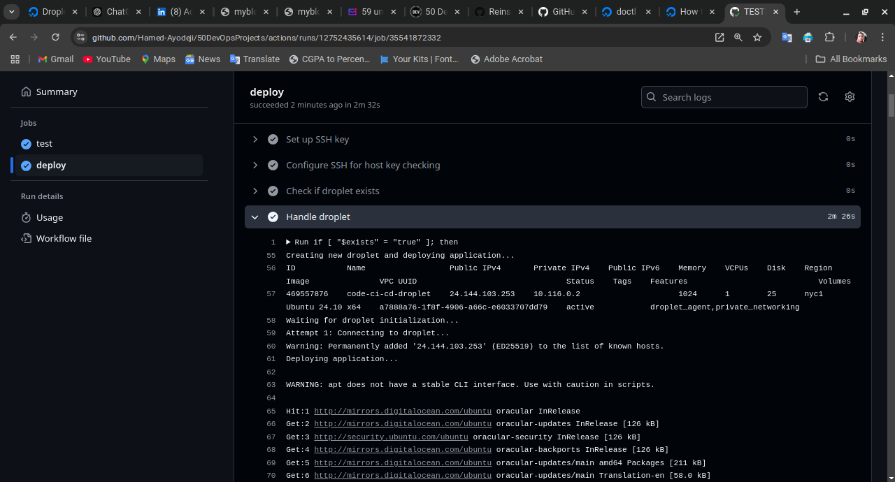
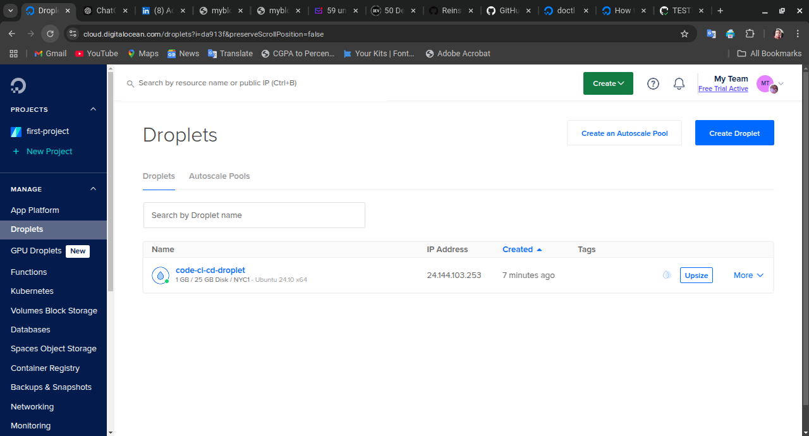
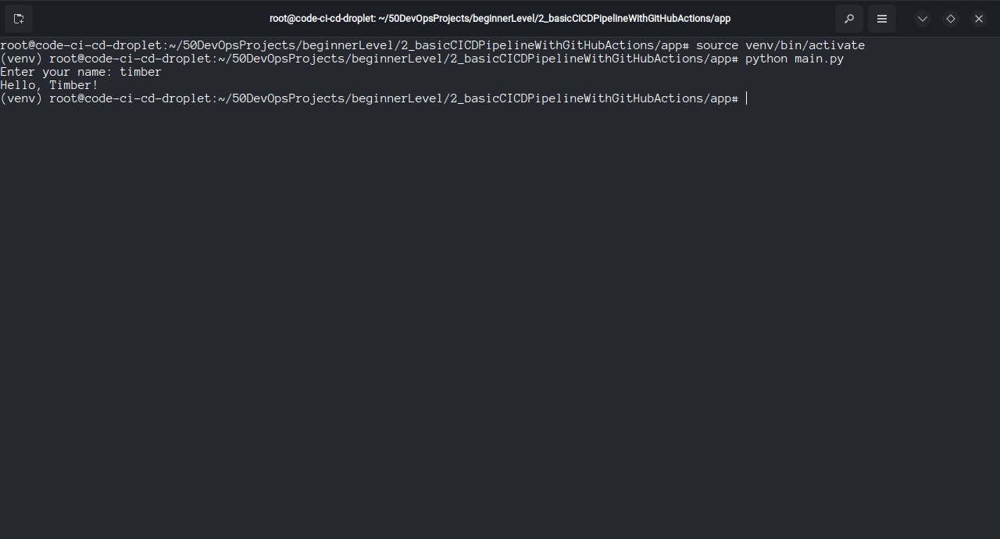
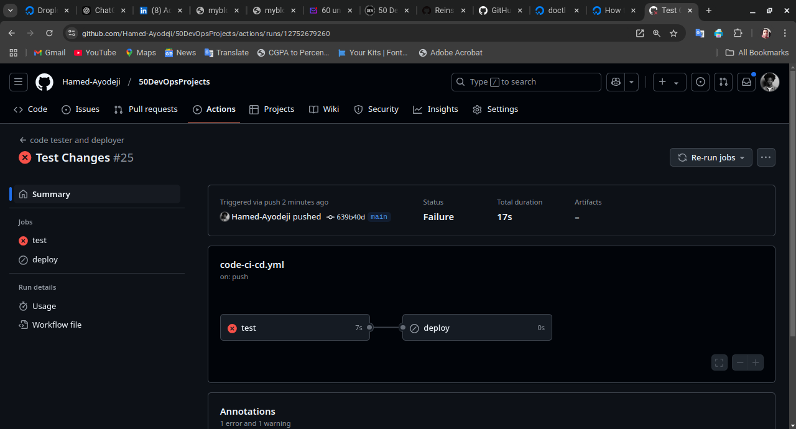
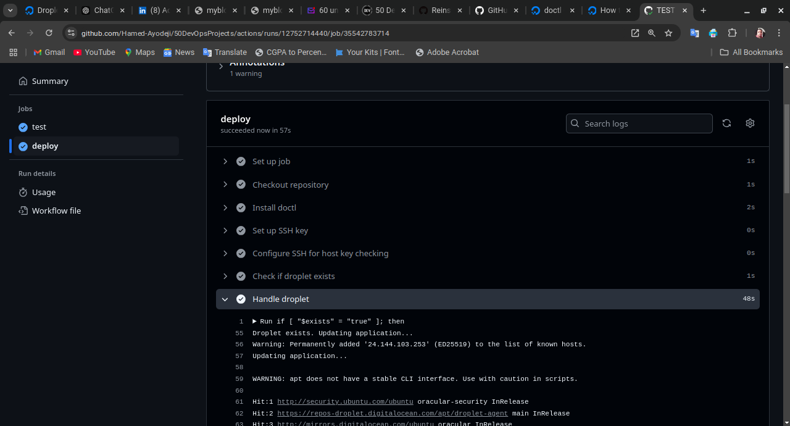
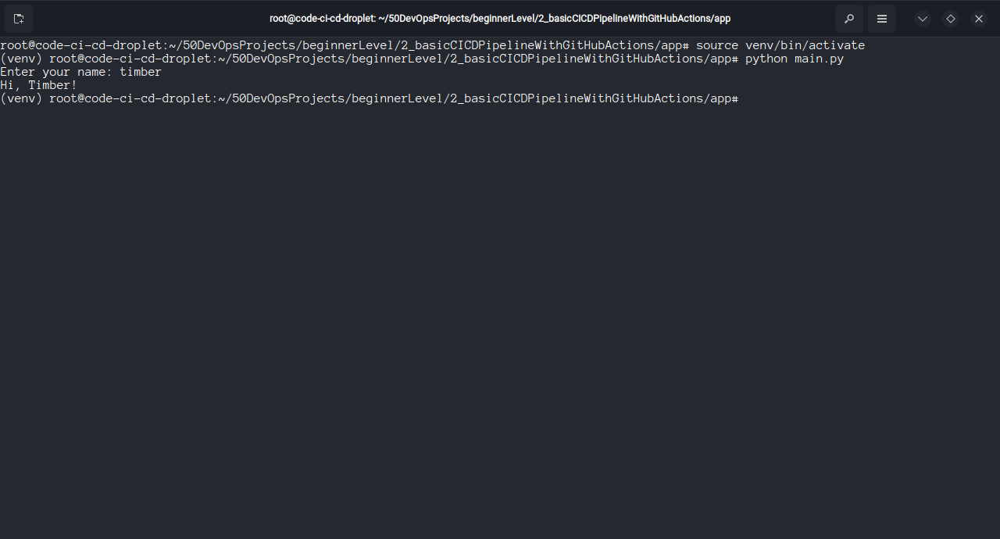

# **Documentation for the Basic CI/CD Pipeline with GitHub Actions (code-ci-cd.yml)**

## **Overview**

This project demonstrates the implementation of a **Basic CI/CD Pipeline** using **GitHub Actions** to automate the testing and deployment of a simple Python application. The pipeline ensures reliable and efficient integration and deployment by:

1. **Automated Testing**:
   - Executes unit tests on code changes pushed to the `main` branch using Python’s `unittest` framework within a virtual environment.

2. **Automated Deployment**:
   - Deploys the application to a **DigitalOcean droplet** upon successful testing.
   - Handles droplet updates or creates a new droplet as needed, ensuring seamless deployments.

This workflow streamlines the development process, providing a foundation for robust DevOps practices.

---

## **Project Structure**

The project follows a well-structured directory layout, enabling ease of navigation and management. Below is the structure:

```plaintext
.github/workflows/
  code-ci-cd.yml          # CI/CD workflow file

beginnerLevel/
  2_basicCICDPipelineWithGitHubActions/
    app/
      main.py             # Python application
      README.md           # App documentation
    test/
      test_main.py        # Unit tests for the app
      README.md           # Test documentation
    requirements.txt      # Dependencies for the project
    venv/                 # Virtual environment for local testing
```

### **Python Application**

#### **App**

- The `main.py` file contains a Python script that accepts user input and returns a formatted greeting.
- It incorporates basic functions and conditional logic to handle different inputs, including edge cases.
- For more details, refer to the [App Documentation](./app/README.md).

#### **Test**

- The `test_main.py` file validates the behavior of the application using Python’s `unittest` framework.
- It includes test cases for various scenarios, such as valid input, invalid input, and edge cases.
- For more details, refer to the [Test Documentation](./test/README.md).

---

## **CI/CD Workflow**

The CI/CD workflow is defined in the `code-ci-cd.yml` file located in the `.github/workflows/` directory. It automates the testing and deployment process for the Python application. Below is a detailed breakdown of the workflow configuration:

---

### **1. Workflow Trigger**

The workflow is triggered on a `push` event to the `main` branch. It specifically monitors changes in the following paths:

```yaml
on:
  push:
    branches:
      - main
    paths:
      - 'beginnerLevel/2_basicCICDPipelineWithGitHubActions/app/**'
      - 'beginnerLevel/2_basicCICDPipelineWithGitHubActions/test/**'
      - 'beginnerLevel/2_basicCICDPipelineWithGitHubActions/requirements.txt'
```

This ensures that only relevant changes to the application, test files, or dependencies trigger the workflow.

---

### **2. Workflow Jobs**

The workflow consists of two jobs: `test` and `deploy`. The `deploy` job is dependent on the success of the `test` job, ensuring only verified code is deployed.

---

#### **a. Test Job**

- **Purpose**: To verify the correctness of the Python application.
- **Runs on**: `ubuntu-latest`.

**Steps**:

1. **Checkout Repository**:
   - Clones the repository into the runner environment.

   ```yaml
   - name: Checkout repository
     uses: actions/checkout@v4
   ```

2. **Set Up Python Environment**:
   - Creates a virtual environment and installs dependencies.

   ```yaml
   - name: Set up Python environment
     run: |
       python3 -m venv venv
       source venv/bin/activate
       pip install -r ${{ env.REQUIREMENTS_FILE }}
   ```

3. **Run Tests**:
   - Executes unit tests using Python’s `unittest` framework.

   ```yaml
   - name: Run tests
     run: |
       export PYTHONPATH=$(pwd)/beginnerLevel/2_basicCICDPipelineWithGitHubActions
       source venv/bin/activate
       python -m unittest discover -s beginnerLevel/2_basicCICDPipelineWithGitHubActions/test -p "test_*.py"
   ```

   The `export PYTHONPATH=$(pwd)/beginnerLevel/2_basicCICDPipelineWithGitHubActions` command ensures that the test files can import the application modules correctly.

---

#### **b. Deploy Job**

- **Purpose**: To deploy the application to a DigitalOcean droplet.
- **Runs on**: `ubuntu-latest`.
- **Depends on**: Successful execution of the `test` job.

**Steps**:

1. **Checkout Repository**:
   - Clones the repository into the runner environment.

   ```yaml
   - name: Checkout repository
     uses: actions/checkout@v4
   ```

2. **Install doctl**:
   - Installs the DigitalOcean CLI tool.

   ```yaml
   - name: Install doctl
     uses: digitalocean/action-doctl@v2
     with:
       token: ${{ secrets.DIGITALOCEAN_ACCESS_TOKEN }}
   ```

3. **Set Up SSH Key**:
   - Configures SSH keys for droplet access.

   ```yaml
   - name: Set up SSH key
     run: |
       mkdir -p ~/.ssh
       echo "${{ secrets.DIGITALOCEAN_PRIVATE_SSH_KEY }}" > ~/.ssh/id_ed25519
       chmod 400 ~/.ssh/id_ed25519
   ```

   This ensure that the private ssh key is set up for the runner environment to be able to access the droplet.

4. **Configure SSH for Host Key Checking**:
   - Disables strict host key checking to prevent connection issues.

   ```yaml
   - name: Configure SSH for host key checking
     run: |
       echo "Host *" >> ~/.ssh/config
       echo "    StrictHostKeyChecking no" >> ~/.ssh/config
   ```

5. **Check if Droplet Exists**:
   - Determines whether a droplet with the specified name already exists.

   ```yaml
   - name: Check if droplet exists
     id: check-droplet
     run: |
       if doctl compute droplet list --format Name | grep -q "^${{ env.DROPLET_NAME }}$"; then
         echo "exists=true" >> $GITHUB_ENV
       else
         echo "exists=false" >> $GITHUB_ENV
       fi
   ```

6. **Handle Droplet**:
   - Updates an existing droplet or creates a new one and deploys the application.

    ```yaml
    - name: Handle droplet
        run: |
          if [ "$exists" = "true" ]; then
            echo "Droplet exists. Updating application..."
            doctl compute ssh ${{ env.DROPLET_NAME }} --ssh-key-path ~/.ssh/id_ed25519 --ssh-command "
              echo 'Updating application...' && \
              rm -rf ${{ env.LOCAL_PATH }} && \
              sudo apt update -y && \
              sudo apt install -y software-properties-common && \
              sudo apt-add-repository universe && \
              sudo apt update -y && \
              sudo apt install -y python3 python3-venv python3-pip git && \
              git clone ${{ env.GIT_REPO }} ${{ env.LOCAL_PATH }} && \
              cd ${{ env.APP_PATH }} && \
              python3 -m venv venv && \
              source venv/bin/activate && \
              pip install -r ${{ env.REQUIREMENTS_FILE }}
            "
          else
            echo "Creating new droplet and deploying application..."
            doctl compute droplet create ${{ env.DROPLET_NAME }} --image ${{ env.IMAGE }} --region ${{ env.REGION }} --size ${{ env.SIZE }} --ssh-keys ${{ secrets.DIGITALOCEAN_SSH_KEY_ID }} --wait
            echo "Waiting for droplet initialization..."
            sleep 30
            for i in {1..5}; do
              echo "Attempt $i: Connecting to droplet..."
              if doctl compute ssh ${{ env.DROPLET_NAME }} --ssh-key-path ~/.ssh/id_ed25519 --ssh-command "
                echo 'Deploying application...' && \
                sudo apt update -y && \
                sudo apt install -y software-properties-common && \
                sudo apt-add-repository universe && \
                sudo apt update -y && \
                sudo apt install -y python3 python3-venv python3-pip git && \
                git clone ${{ env.GIT_REPO }} ${{ env.LOCAL_PATH }} && \
                cd ${{ env.APP_PATH }} && \
                python3 -m venv venv && \
                source venv/bin/activate && \
                pip install -r ${{ env.REQUIREMENTS_FILE }}
              "; then
                break
              fi
              echo "Retrying in 10 seconds..."
              sleep 10
            done
          fi
    ```

---

## **Usage**

This section explains how to use the CI/CD pipeline, from triggering the workflow to deploying the application.

---

### **1. Pre-Requisites**

- **GitHub Repository**: Contains the application, tests, and `requirements.txt`.
- **DigitalOcean Account**: With API tokens and SSH key configured.
- **Secrets Configuration**:
  - `DIGITALOCEAN_ACCESS_TOKEN`: Your DigitalOcean API token.
    To create a new token, refer to the [DigitalOcean documentation](https://www.digitalocean.com/docs/apis-clis/api/create-personal-access-token/).
  - `DIGITALOCEAN_PRIVATE_SSH_KEY`: The private SSH key for accessing the droplet.
    To get the list of SSH keys, run

      ```sh
      doctl compute ssh-key list
      ```

  - `DIGITALOCEAN_SSH_KEY_ID`: The ID of the SSH key configured on your DigitalOcean account.
    To get the ID, run

      ```sh
      doctl compute ssh-key list
      ```

---

### **2. Triggering the Workflow**

The CI/CD pipeline is triggered automatically on every push to the `main` branch. The following file changes will trigger the workflow:

- Files in `app/`
- Files in `test/`
- `requirements.txt`

#### Manual Trigger

You can also manually trigger the workflow using the **GitHub Actions** interface.

---

### **3. Running Locally**

1. Clone the repository and navigate to the project directory:

   ```bash
   git clone https://github.com/Hamed-Ayodeji/50DevOpsProjects.git
   cd 50DevOpsProjects/beginnerLevel/2_basicCICDPipelineWithGitHubActions
    ```

2. Set up a virtual environment:

   ```bash
   python3 -m venv venv
   source venv/bin/activate
   pip install -r requirements.txt
   ```

3. Run the tests

   ```bash
   python -m unittest test.test_main
   ```

4. Run the application:

   ```bash
   python test/main.py
   ```

---

### **4. Accessing the Deployed Application**

Once the deployment is complete:

1. Log in to the DigitalOcean droplet:

   ```bash
   ssh -i ~/.ssh/id_ed25519 root@<droplet_public_ip>
   ```

2. Navigate to the application directory:

   ```bash
   cd /root/50DevOpsProjects/beginnerLevel/2_basicCICDPipelineWithGitHubActions/app
   ```

3. Activate the virtual environment:

   ```bash
   source venv/bin/activate
   ```

4. Run the application:

   ```bash
   python main.py
   ```

---

### **5. Workflow Example**

#### **a. Testing and Running the Application Locally**

- **Testing with Virtual Environment**  
  

  In this screenshot the python application was tested using the unittest framework locally.

- **Running the Application Locally**  
  

  In this screenshot the python application was ran locally.

#### **b. Workflow Execution**

- **No Existing Droplet Found**  
  

  This screenshot shows that no existing droplet was found in the DigitalOcean account before running the workflow.

- **Successful Workflow Execution**  
  

  This screenshot shows the successful execution of the CI/CD pipeline, including testing and deployment.

#### **c. Deployment**

- **Creating a New Droplet**  
  

  This screenshot lays emphasis on the `Handle droplet` step of the workflow, you can see it detected there was no existing droplet and proceeded to create a new one for deployment.

- **Droplet Created Successfully**  
  

  This shows the new droplet that was successfully created for the deployment of the application.

- **Testing Deployment on New Droplet**  
  

  This screenshot shows the successful deployment of the application on the new droplet. The application was tested to ensure it was running as expected. It prompted for an input, i gave it a name `timber` and it formatted the name and returned a greeting `Hello, Timber!` as expected.

#### **d. Handling Failed Tests**

- **Test Failure Logged in Workflow**  
  

  This screenshot shows the workflow stopping due to a test failure. The error message is logged, and the deployment step is skipped.

#### **e. Applying Changes**

- **Redeploying Application to Existing Droplet**  
  

  This screenshot shows the workflow detecting an existing droplet and updating the application on it.

- **Changes Successfully Reflected**  
  

  This screenshot shows the successful deployment of the updated application on the existing droplet. The changes were reflected in the application output. It prompted for an input, i gave it a name `timber` and it formatted the name and returned a different greeting `Hi, Timber!` as the changes were successfully applied.

This usage guide and the accompanying screenshots provide a step-by-step demonstration of how the CI/CD pipeline is executed, ensuring smooth testing and deployment.

## **Contributing**

Contributions to this project are welcome and encouraged. To contribute, follow these steps:

1. Fork the repository.
2. Create a new branch (`git checkout -b feature-branch`).
3. Make your changes.
4. Commit your changes (`git commit -am 'Add new feature'`).
5. Push to the branch (`git push origin feature-branch`).
6. Create a new Pull Request.

Your contributions will be reviewed, and once approved, they will be merged into the main project.

## **Conclusion**

This project showcases a **Basic CI/CD Pipeline** for testing and deploying a Python application. The pipeline enforces quality control through automated testing and efficient deployment to a cloud environment. It serves as a strong foundation for incorporating CI/CD into any software development workflow.
