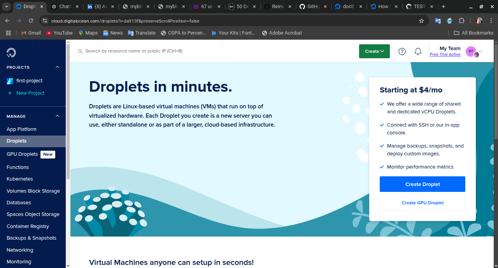

# **Documentation for the basic CICD pipeline with GitHub action (code-ci-cd-yml)**

## **Overview**

This project sets up a **Basic CI/CD Pipeline** using **GitHub Actions** to automate the testing and deployment of a simple Python application. The pipeline ensures reliable and efficient integration and deployment by:

1. **Automated Testing**:
   - Runs tests on code changes pushed to the `main` branch using Python’s `unittest` module within a virtual environment.

2. **Automated Deployment**:
   - Deploys the application to a **DigitalOcean droplet** upon successful testing.
   - Handles droplet updates or creation as needed, ensuring seamless deployments.

This workflow streamlines the development process, providing a foundation for robust DevOps practices.

## **Project Structure**

This project follows a simple and organized directory structure, making it easy to manage and extend. Here's an overview of the structure:

```text
.github/workflows/
  code-ci-cd.yml          # CI/CD workflow file

beginnerLevel/
  2_basicCICDPipelineWithGitHubActions/
    app/
      main.py             # Python application
      README.md           # App documentation
    test/
      test_main.py        # Unit tests for the app
      README.md           # Test documentation
    requirements.txt      # Dependencies for the project
    venv/                 # Virtual environment for local testing
```

### **Python Application**

#### **App**

- The `main.py` file contains a simple Python script that accepts user input and returns a formatted greeting.
- The app uses basic functions and conditional logic to process the input, ensuring valid responses for edge cases.
- For more details, see the [App Documentation](./beginnerLevel/2_basicCICDPipelineWithGitHubActions/app/README.md).

#### **Test**

- The `test_main.py` file contains unit tests to validate the behavior of the app using Python’s `unittest` framework.
- The tests cover a variety of scenarios, including valid input, invalid input, and edge cases.
- For more details, see the [Test Documentation](./beginnerLevel/2_basicCICDPipelineWithGitHubActions/test/README.md).

### **Workflow**

- The `code-ci-cd.yml` file in `.github/workflows/` defines the GitHub Actions pipeline for this project. It includes jobs for testing and deployment.

## **CI/CD Workflow**

The CI/CD workflow for this project is defined in the `code-ci-cd.yml` file located in the `.github/workflows/` directory. This workflow automates the testing and deployment of the Python application. Here’s a detailed breakdown of the workflow configuration:

---

### **1. Workflow Trigger**

The workflow is triggered on a `push` event to the `main` branch. It specifically monitors changes in the following paths:

```yaml
on:
  push:
    branches:
      - main
    paths:
      - 'beginnerLevel/2_basicCICDPipelineWithGitHubActions/app/**'
      - 'beginnerLevel/2_basicCICDPipelineWithGitHubActions/test/**'
      - 'beginnerLevel/2_basicCICDPipelineWithGitHubActions/requirements.txt'
```

This ensures that only relevant changes to the application, test files, or dependencies will trigger the workflow.

---

### **2. Workflow Jobs**

The workflow contains two jobs: `test` and `deploy`. The `deploy` job depends on the success of the `test` job to ensure only valid code is deployed.

#### **a. Test Job**

- **Purpose**: To test the Python application for correctness.
- **Runs on**: `ubuntu-latest`.

**Steps**:

1. **Checkout Repository**: Clones the repository into the runner environment.

   ```yaml
   - name: Checkout repository
     uses: actions/checkout@v4
   ```

2. **Set Up Python Environment**: Creates a virtual environment and installs project dependencies.

   ```yaml
   - name: Set up Python environment
     run: |
       python3 -m venv venv
       source venv/bin/activate
       pip install -r ${{ env.REQUIREMENTS_FILE }}
   ```

3. **Run Tests**: Executes unit tests using Python's `unittest` framework.

   ```yaml
   - name: Run tests
     run: |
       export PYTHONPATH=$(pwd)/beginnerLevel/2_basicCICDPipelineWithGitHubActions
       source venv/bin/activate
       python -m unittest discover -s beginnerLevel/2_basicCICDPipelineWithGitHubActions/test -p "test_*.py"
   ```

---

#### **b. Deploy Job**

- **Purpose**: To deploy the application to a DigitalOcean droplet.
- **Runs on**: `ubuntu-latest`.
- **Depends on**: Successful execution of the `test` job.

**Steps**:

1. **Checkout Repository**: Clones the repository into the runner environment.

   ```yaml
   - name: Checkout repository
     uses: actions/checkout@v4
   ```

2. **Install doctl**: Installs the DigitalOcean CLI tool for managing droplets.

   ```yaml
   - name: Install doctl
     uses: digitalocean/action-doctl@v2
     with:
       token: ${{ secrets.DIGITALOCEAN_ACCESS_TOKEN }}
   ```

3. **Set Up SSH Key**: Configures SSH keys for secure droplet access.

   ```yaml
   - name: Set up SSH key
     run: |
       mkdir -p ~/.ssh
       echo "${{ secrets.DIGITALOCEAN_PRIVATE_SSH_KEY }}" > ~/.ssh/id_ed25519
       chmod 400 ~/.ssh/id_ed25519
   ```

4. **Configure SSH for Host Key Checking**: Disables strict host key checking to avoid connection issues.

   ```yaml
   - name: Configure SSH for host key checking
     run: |
       echo "Host *" >> ~/.ssh/config
       echo "    StrictHostKeyChecking no" >> ~/.ssh/config
   ```

5. **Check If Droplet Exists**: Verifies if a droplet with the specified name already exists.

   ```yaml
   - name: Check if droplet exists
     id: check-droplet
     run: |
       if doctl compute droplet list --format Name | grep -q "^${{ env.DROPLET_NAME }}$"; then
         echo "exists=true" >> $GITHUB_ENV
       else
         echo "exists=false" >> $GITHUB_ENV
       fi
   ```

6. **Handle Droplet**:
   - If the droplet exists:
     - Deletes the existing codebase.
     - Updates the application and dependencies.
   - If the droplet does not exist:
     - Creates a new droplet.
     - Deploys the application.

   ```yaml
   - name: Handle droplet
     run: |
       if [ "$exists" = "true" ]; then
         echo "Droplet exists. Updating application..."
         doctl compute ssh ${{ env.DROPLET_NAME }} --ssh-key-path ~/.ssh/id_ed25519 --ssh-command "
           rm -rf ${{ env.LOCAL_PATH }} && \
           sudo apt update -y && \
           sudo apt install -y software-properties-common && \
           sudo apt-add-repository universe && \
           sudo apt update -y && \
           sudo apt install -y python3 python3-venv python3-pip git && \
           git clone ${{ env.GIT_REPO }} ${{ env.LOCAL_PATH }} && \
           cd ${{ env.APP_PATH }} && \
           python3 -m venv venv && \
           source venv/bin/activate && \
           pip install -r ${{ env.REQUIREMENTS_FILE }}
         "
       else
         echo "Creating new droplet and deploying application..."
         doctl compute droplet create ${{ env.DROPLET_NAME }} --image ${{ env.IMAGE }} --region ${{ env.REGION }} --size ${{ env.SIZE }} --ssh-keys ${{ secrets.DIGITALOCEAN_SSH_KEY_ID }} --wait
         sleep 30
         for i in {1..5}; do
           if doctl compute ssh ${{ env.DROPLET_NAME }} --ssh-key-path ~/.ssh/id_ed25519 --ssh-command "
             sudo apt update -y && \
             sudo apt install -y software-properties-common && \
             sudo apt-add-repository universe && \
             sudo apt update -y && \
             sudo apt install -y python3 python3-venv python3-pip git && \
             git clone ${{ env.GIT_REPO }} ${{ env.LOCAL_PATH }} && \
             cd ${{ env.APP_PATH }} && \
             python3 -m venv venv && \
             source venv/bin/activate && \
             pip install -r ${{ env.REQUIREMENTS_FILE }}
           "; then
             break
           fi
           sleep 10
         done
       fi
   ```

---

### **Key Features**

1. **Automated Testing**: Ensures that only tested and reliable code gets deployed.
2. **Droplet Validation**: Prevents redundant droplet creation by verifying if the droplet already exists.
3. **Incremental Deployment**: Handles both updating an existing droplet and deploying to a new one.
4. **Error Handling**: Includes retries and fallbacks for droplet connection issues.

This workflow ensures a robust CI/CD pipeline for automating the testing and deployment of the Python application.

## **Usage**

This section explains how to use the project’s CI/CD pipeline, from setting up the workflow to deploying the application on a DigitalOcean droplet.

---

### **1. Pre-Requisites**

Before using the pipeline, ensure the following are in place:

- **GitHub Repository**: The project repository must contain the Python application, test files, and `requirements.txt`.
- **DigitalOcean Account**: Access to a DigitalOcean account with API tokens and an existing SSH key configured.
- **Secrets Configuration**:
  - `DIGITALOCEAN_ACCESS_TOKEN`: Your DigitalOcean API token.
  - `DIGITALOCEAN_PRIVATE_SSH_KEY`: The private SSH key for accessing the droplet.
  - `DIGITALOCEAN_SSH_KEY_ID`: The ID of the SSH key configured on your DigitalOcean account.

---

### **2. Triggering the Workflow**

The CI/CD pipeline is triggered automatically on every push to the `main` branch. The following file changes will trigger the workflow:

- Files in `app/`
- Files in `test/`
- `requirements.txt`

#### Manual Trigger

You can also manually trigger the workflow using the **GitHub Actions** interface.

---

### **3. Steps to Execute**

#### **a. Test Job**

1. **Tests the application** using the `unittest` framework.
2. **Setup**:
   - Creates a virtual environment.
   - Installs dependencies from `requirements.txt`.
3. **Execution**:
   - Runs the unit tests located in the `test/` directory.
4. **Outcome**:
   - Pass: Proceeds to the deployment step.
   - Fail: Stops the workflow and logs the errors.

#### **b. Deploy Job**

1. **Checks if a droplet exists**:
   - If it exists:
     - Updates the application.
   - If it does not exist:
     - Creates a new droplet and deploys the application.
2. **Setup**:
   - Configures SSH access.
   - Installs required software (Python, Git).
3. **Deployment**:
   - Clones the latest code.
   - Creates a virtual environment.
   - Installs dependencies.
4. **Outcome**:
   - Successfully deploys the application on a DigitalOcean droplet.

---

### **4. Running Locally**

To test or run the application locally:

1. Navigate to the project directory:

   ```bash
   cd beginnerLevel/2_basicCICDPipelineWithGitHubActions/app
   ```

2. Set up a virtual environment:

   ```bash
   python3 -m venv venv
   source venv/bin/activate
   ```

3. Install dependencies:

   ```bash
   pip install -r ../requirements.txt
   ```

4. Run the application:

   ```bash
   python main.py
   ```

5. Run the tests:

   ```bash
   cd ../test
   python -m unittest test_main.py
   ```

---

### **5. Accessing the Deployed Application**

Once the deployment is complete:

1. Log in to the DigitalOcean droplet:

   ```bash
   ssh root@<droplet_public_ip> -i ~/.ssh/id_ed25519
   ```

2. Navigate to the application directory:

   ```bash
   cd /root/50DevOpsProjects/beginnerLevel/2_basicCICDPipelineWithGitHubActions/app
   ```

3. Activate the virtual environment:

   ```bash
   source venv/bin/activate
   ```

4. Run the application:

   ```bash
   python main.py
   ```

---

### **6. Workflow Example**

#### **a. Testing and Running the Application Locally**

- **Testing with Virtual Environment**  
  

  In this screenshot the python application was test using the unittest framework locally.

- **Running the Application Locally**  
  

  In this screenshot the python application was run locally.

#### **b. Workflow Execution**

- **No Existing Droplet Found**  
  

  This screenshot shows that no existing droplet was found in the DigitalOcean account before running the workflow.

- **Successful Workflow Execution**  
  

  This screenshot shows the successful execution of the CI/CD pipeline, including testing and deployment.

#### **c. Deployment**

- **Creating a New Droplet**  
  

  This screenshot lays emphasis on the `Handle droplet` step of the workflow, you can see it detected there was no existing droplet and proceeded to create a new one for deployment.

- **Droplet Created Successfully**  
  

  This shows the new droplet that was created for the deployment of the application.

- **Testing Deployment on New Droplet**  
  

  This screenshot shows the successful deployment of the application on the new droplet. The application was tested to ensure it was running as expected. It prompted me for an input, i gave it a name `timber` and it formatted the name and returned a greeting `Hello, Timber!` as expected.

#### **d. Handling Failed Tests**

- **Test Failure Logged in Workflow**  
  

  This screenshot shows the workflow stopping due to a test failure. The error message is logged, and the deployment step is skipped.

#### **e. Applying Changes**

- **Redeploying Application to Existing Droplet**  
  

  This screenshot shows the workflow detecting an existing droplet and updating the application on it. The application was tested to ensure the changes were successfully applied.

- **Changes Successfully Reflected**  
  

  This screenshot shows the successful deployment of the updated application on the existing droplet. The changes were reflected in the application output. It prompted me for an input, i gave it a name `timber` and it formatted the name and returned a different greeting `Hi, Timber!` as the changes were successfully applied.

This usage guide and the accompanying screenshots provide a step-by-step demonstration of how the CI/CD pipeline is executed, ensuring smooth testing and deployment.

## **Contributing**

Contributions to this project are welcome and encouraged. To contribute, follow these steps:

1. Fork the repository.
2. Create a new branch (`git checkout -b feature-branch`).
3. Make your changes.
4. Commit your changes (`git commit -am 'Add new feature'`).
5. Push to the branch (`git push origin feature-branch`).
6. Create a new Pull Request.

Your contributions will be reviewed, and once approved, they will be merged into the main project.

## **Conclusion**

This project demonstrates the implementation of a basic CI/CD pipeline using GitHub Actions for automating the testing and deployment of a Python application. By following the steps outlined in this documentation, you can set up and utilize the pipeline effectively. The workflow ensures reliable testing and deployment, streamlining the development process and fostering best practices in DevOps.
