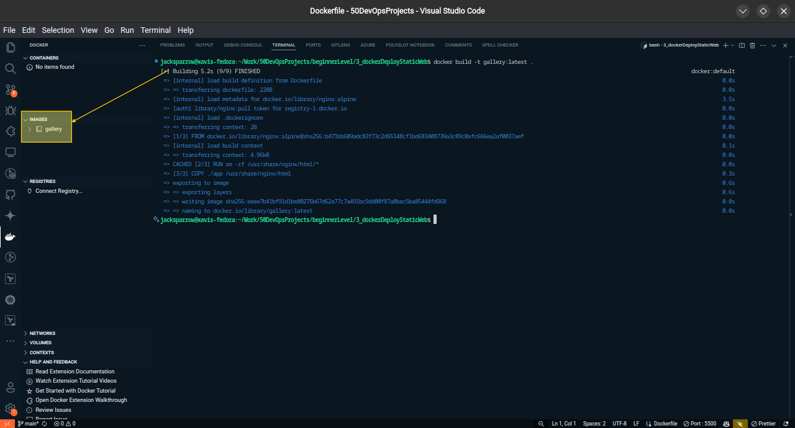
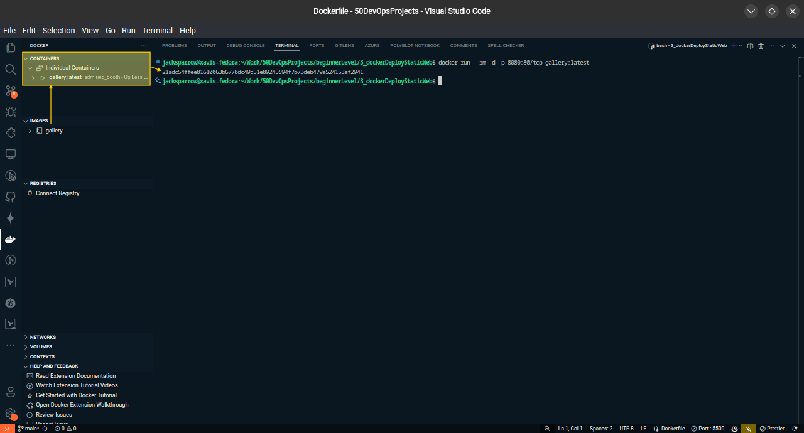
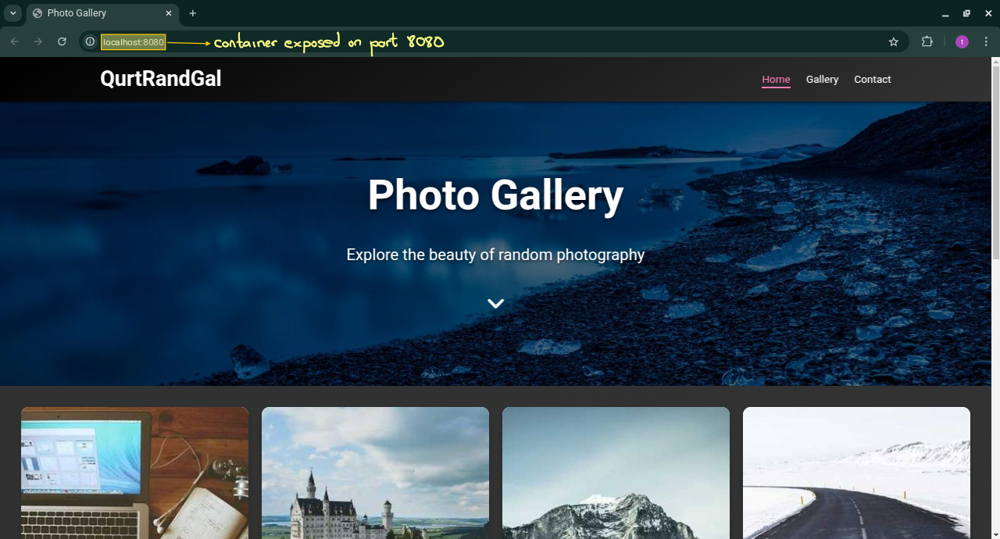

# **Deploying a Static Website with Docker**

## **Overview**

This project demonstrates how to **deploy a simple static website** using **Docker**. The website, built with **HTML, CSS, and JavaScript**, is packaged into a **Docker container** and served using **NGINX**. This method ensures **portability, scalability, and easy deployment** across different environments.

### **What You’ll Learn**

By completing this project, you will gain hands-on experience with:

- Creating a **Dockerfile** for a static website.
- Building a **Docker image**.
- Running a **Docker container** locally.
- Optimizing and managing a **containerized web application**.
- Pushing a **Docker image to Docker Hub** for distribution.

---

## **Project Structure**

The project follows a structured directory layout:

```plaintext
📂 3_dockerDeployStaticWeb/
│── 📂 .img/           # Images for README
│── 📂 app/            # Website files
│   │── 📄 index.html  # HTML file
│   │── 📄 README.md   # Documentation for the website
│   │── 📄 script.js   # JavaScript file
│   │── 📄 style.css   # CSS file
│── 📄 .dockerignore   # Files to exclude from the image
│── 📄 Dockerfile      # Dockerfile for building the image
│── 📄 README.md       # Project instructions
```

---

## **Step 1: Create a Simple Static Website**

The website files consist of **HTML, CSS, and JavaScript**. You can use your own files or refer to the ones in the **[app](./app/)** directory.  

For detailed documentation on the static website, check the **[README](./app/README.md)** in the `app/` directory.

---

## **Step 2: Create a Dockerfile**

A **Dockerfile** contains instructions for building a **Docker image**. Here’s the **Dockerfile** for this project:

```dockerfile
# Use NGINX as the base image
FROM nginx:alpine

# Remove default NGINX static content
RUN rm -rf /usr/share/nginx/html/*

# Copy website files to the NGINX directory
COPY ./app /usr/share/nginx/html

# Expose port 80 for web traffic
EXPOSE 80

# Start the NGINX server
CMD ["nginx", "-g", "daemon off;"]
```

### **Explanation:**

- Uses **NGINX:alpine** as the base image (**lightweight and efficient**).
- Removes the default NGINX content.
- Copies the **website files** from the `app/` directory into the container.
- Exposes **port 80** for the web server.
- Runs **NGINX** in the foreground.

---

## **Step 3: Build the Docker Image**

To **build the image**, navigate to the project directory and run:

```sh
docker build -t gallery:latest .
```

📌 **What This Does:**

- Uses the **Dockerfile** in the current directory (`.`).
- Tags the image as **gallery:latest**.



---

## **Step 4: Run the Docker Container**

To **run the container** and map **port 80** (inside the container) to **port 8080** (on your local machine), use:

```sh
docker run -d -p 8080:80 gallery:latest
```

📌 **What This Does:**

- Runs the container **in detached mode** (`-d`).
- Maps **localhost:8080** to the container’s **port 80**.



Now, open **[http://localhost:8080/](http://localhost:8080/)** in a browser to view the website.



---

## **Step 5: Verify Running Containers**

To check if the container is running:

```sh
docker ps
```

To **stop the container**:

```sh
docker stop <container_id>
```

To **remove the container**:

```sh
docker rm <container_id>
```

---

## **Step 6: Optimize the Docker Image**

Here are some **best practices** to optimize the Docker image:

✅ **Use a Lightweight Base Image**  
The project already uses **nginx:alpine**, which is a **minimalist image**.

✅ **Minify Website Assets**  
Compressing **CSS, JS, and images** reduces the overall **image size**.

---

## **Step 7: Push the Image to Docker Hub**

To make your image **accessible remotely**, push it to **Docker Hub**.

### **Login to Docker Hub**

```sh
docker login
```

### **Tag the Image**

```sh
docker tag gallery:latest username/gallery:latest
```

### **Push the Image**

```sh
docker push username/gallery:latest
```

---

## **Step 8: Deploy to a Cloud Server**

You can deploy this **Dockerized website** on a **cloud server (AWS, DigitalOcean, GCP, etc.)**.

### **Steps to Deploy on a Remote Server**

1. **SSH into your cloud server**

   ```sh
   ssh user@your-server-ip
   ```

2. **Install Docker (if not installed)**

   ```sh
   sudo apt update
   sudo apt install docker.io -y
   ```

3. **Pull the Docker Image**

   ```sh
   docker pull username/gallery:latest
   ```

4. **Run the Container**

   ```sh
   docker run -d -p 80:80 username/gallery:latest
   ```

Now, your website is live on **<http://your-server-ip/>** 🎉

---

Here’s a more structured and **comprehensive** improvement of your **Troubleshooting** section:

---

## **Troubleshooting Guide**

Encountering issues while deploying the Docker container? Here are some common problems and solutions:

| **Issue** | **Possible Cause** | **Solution** |
|-----------|-------------------|-------------|
| **`docker: command not found`** | Docker is not installed or not in your system's `PATH`. | Install Docker using:<br>🔹 **Ubuntu/Debian:** `sudo apt install docker.io -y`<br>🔹 **CentOS/RHEL:** `sudo yum install docker -y`<br>🔹 **Mac:** Install via [Docker Desktop](https://www.docker.com/products/docker-desktop/) |
| **Website not loading** | The container may not be running, or there is a network issue. | 🔹 Check if the container is running: `docker ps`<br>🔹 If stopped, restart it: `docker start <container_id>`<br>🔹 Ensure the correct port is mapped: `docker ps -a` |
| **Port conflict (Address already in use)** | Another process (e.g., NGINX, Apache) is already using port **80**. | Try one of the following solutions:<br>🔹 Use a different port: `docker run -d -p 8081:80 gallery:latest`<br>🔹 Find the conflicting service: `sudo lsof -i :80`<br>🔹 Stop the conflicting service:<br> → `sudo systemctl stop nginx` (NGINX)<br> → `sudo systemctl stop apache2` (Apache)<br>🔹 Restart Docker and try again:<br> `sudo systemctl restart docker && docker run -d -p 80:80 gallery:latest` |
| **Cannot push image to Docker Hub (`unauthorized` error)** | You are not logged into Docker Hub. | 🔹 Log in to Docker Hub: `docker login`<br>🔹 Ensure your image is properly tagged: `docker tag gallery:latest username/gallery:latest`<br>🔹 Push again: `docker push username/gallery:latest` |
| **Container exited immediately after running** | The process inside the container **stopped running**. | 🔹 Check logs: `docker logs <container_id>`<br>🔹 Run interactively to debug: `docker run -it gallery:latest /bin/sh` |
| **File changes not reflected in the container** | The container is running an old image. | 🔹 Rebuild the image: `docker build -t gallery:latest .`<br>🔹 Remove old containers: `docker rm -f $(docker ps -aq)`<br>🔹 Restart the container: `docker run -d -p 8080:80 gallery:latest` |

---

## **Key Takeaways**

🚀 **Docker** simplifies website deployment by packaging everything into a **self-contained** container.  
💡 **NGINX:ALPINE** is a **fast and lightweight** web server.  
📦 **Docker Hub** makes sharing and deploying Docker images **seamless**.  

This project is a **stepping stone** to more advanced Docker concepts, including **multi-container applications** and **CI/CD pipelines**.

---

## **Future Improvements**

✅ Add **Docker Compose** to manage multiple services.  
✅ Implement a **CI/CD pipeline** for automated deployments.  
✅ Deploy using **Kubernetes** for scalability.  

---

## **Conclusion**

This project showcases **how Docker can simplify static website deployment**. By **containerizing the website**, we ensure **consistency, portability, and effortless deployment** across different environments.

Want to go further?  
Try deploying this project to a **cloud provider** or integrating **Docker Compose** for a more robust setup! 🚀🔥

---

### **Next Steps**

If you enjoyed this project, check out the **next DevOps project in the series**, where we **Setup Basic System Monitoring**!

---

### **Final Thoughts**

By completing this project, you’ve taken a **big step** toward mastering **Docker for web development**. Keep building, experimenting, and deploying! 🚀💡
